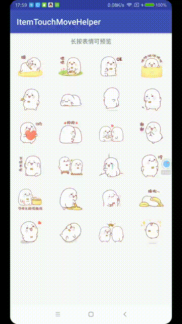

# ItemTouchMoveHelper
RecyclerView的Item滑动触摸辅助类




### Gradle引入
```
implementation 'com.dyhdyh:item-touch-move-helper:1.0.1'
```

### 给RecyclerView添加的滑动触摸监听
```
recyclerView.addOnItemTouchListener(new SimpleItemTouchMoveListener(this){
    @Override
    public void onItemTouchMove(boolean isTouchChild, View childView, int childPosition, MotionEvent event) {
        Log.d("onItemTouchMove----->", isTouchChild + "," + childPosition + "," + event.getX() + "," + event.getY()+","+event.getAction());
    }
});
```

### *实现微信表情预览
本库内置了一个预览效果的监听,开发者在对应的回调控制预览框即可  

```
recyclerView.addOnItemTouchListener(new SimpleMovePreviewListener(this,
 new OnMovePreviewListener() {
    @Override
    public void onPreview(View childView, int childPosition) {
		//弹出预览框
    }

    @Override
    public void onCancelPreview() {
        //取消预览框
    }
}));
```

##### 具体使用可以参考[MainActivity](https://github.com/dengyuhan/ItemTouchMoveHelper/blob/master/app/src/main/java/com/dyhdyh/helper/itemtouch/example/MainActivity.java)
